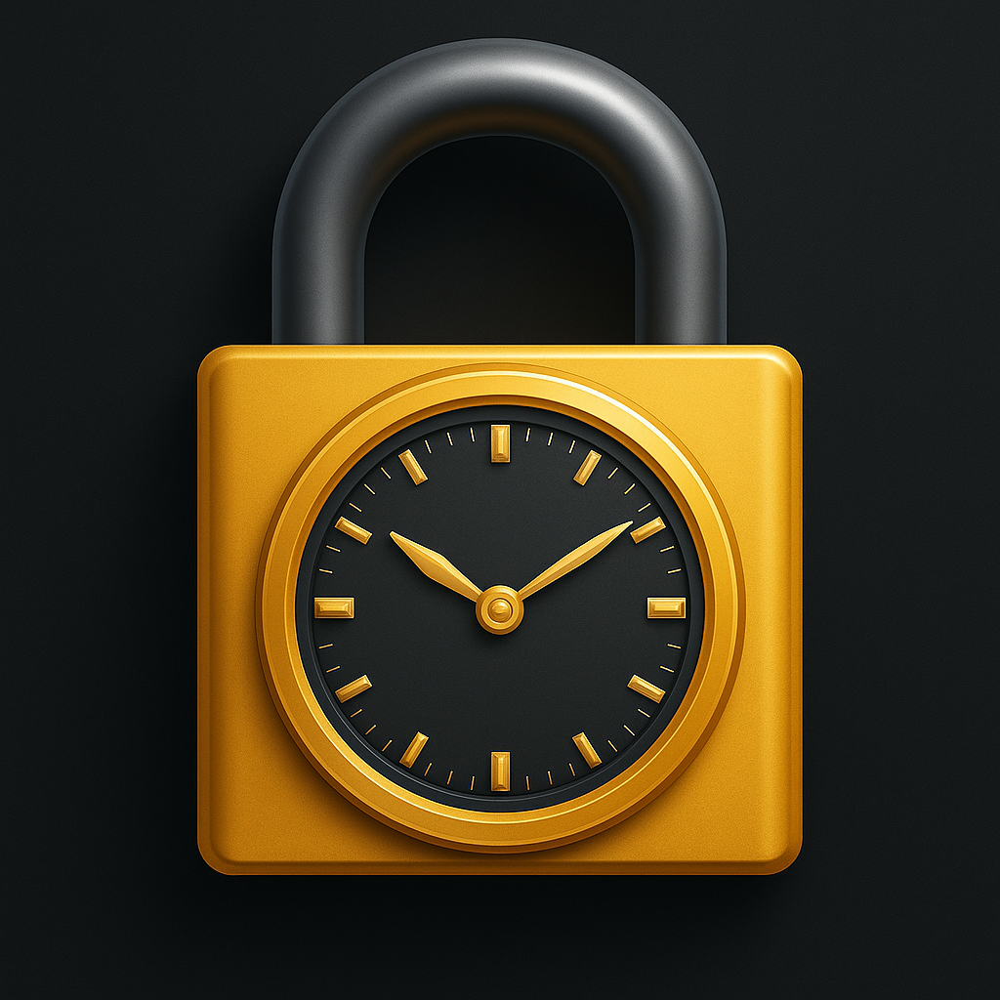

# ChronoLock

ChronoLock is a command-line tool for encrypting plaintext files with a time-based lock. Files cannot be decrypted until a specific unlock date has been reached.



## Purpose

ChronoLock is designed to support deliberate information lockdown[^techlockdown]. Its main use case is self-imposed access restriction—such as temporarily locking an admin password (which allows some unbypassable self-restrictions) temporarilly.

This is not general-purpose encryption software. It assumes a cooperative threat model and a disciplined user.

[^techlockdown]: Tech lockdown

## How it works

- A file is encrypted using a symmetric key (`passphrase`).
- The unlock date is embedded in the encrypted payload.
- Decryption is only possible once the current date is equal to or past the unlock date.
- Unlock time defaults to **12:00 (noon)** in **Europe/Madrid** timezone unless modified in the codebase.

## Caution

- The passphrase is **not stored** and must **not be retained**.
- You should:
  1. Generate a secure random passphrase (e.g., from a password manager).
  2. Compile the binary with the passphrase embedded.
  3. **Permanently delete the passphrase**. Do not store it.
  4. Use the binary to encrypt files.
- If you keep the passphrase, you'll be able to modify the codebase removing date validations and generate a new binary that give you access to the encrypted files (which defies the purpose): Do not recompile with a different passphrase while locked files still exist.

## Installation

```bash
git clone https://github.com/yourusername/ChronoLock.git
cd ChronoLock
swift build -c release
```
## Usage

### Encrypt

```bash
./ChronoLock \
  --input secrets.txt \
  --output secrets.locked \
  --unlock-date 2025-06-01 \
  --mode encrypt
```

### Decrypt

```bash
./ChronoLock \
  --input secrets.locked \
  --output secrets-decrypted.txt \
  --mode decrypt
```
## Limitations

- If you lose the compiled binary, and you have deleted the passphrase, encrypted files cannot be recovered.
- Recompiling with a different passphrase will not allow you to decrypt files encrypted with the previous binary.
- You should only recompile after all existing encrypted files have passed their unlock dates.

## Nice to have / maybe some day

- Encrypt all kind of files as binary data (instead of only text files)

## License

MIT
